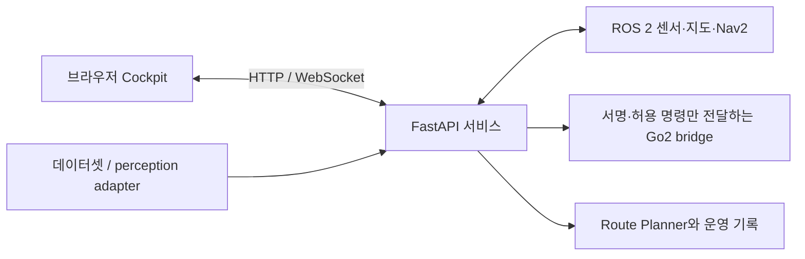

# Robot Scope — ROS 2 로봇 관측·매핑·제어·경로 계획 대시보드

기존 영문 제품 명칭: ROS2 Autonomous Mobile Robot Mapping, Navigation and Control Dashboard.

Robot Scope는 ROS 2 로봇의 센서, 지도, 수동 제어와 경로 계획을 한 브라우저에
모아 운영자가 상태를 확인하고 실패를 진단하도록 돕습니다. 사용 환경은
Ubuntu ROS host의 웹 서비스와 Jetson Orin Nano + Go2 + XT16 구성입니다.
Jetson은 전체 Go2 경로를 검증한 장비이지 웹 대시보드의 필수 조건은 아닙니다.

**현재 검증 경계 (`main` `d81c59e`, 2026-09-13):** 구현과 단계별 소프트웨어·
현장 기록은 있지만 실제 Nav2 목표 도달이나 경기 완주는 확인되지 않았습니다.
2026-09-11 정지 상태 180초 관찰의 localization READY는 경로 승인과 다릅니다.
이전 goal의 odometry arrival gap `0.305144 s` 실패, 2026-09-12 별도 goal의
`command_timeout` 취소가 남아 있습니다. Nav2 입력 `0.30 s` 계약은 합성 시간
replay에서 확인됐고 현장 주행 결과로 확대하지 않습니다. 승인된 perception
모델 artifact와 실장비 acceptance도 없습니다. [증거 표](docs/PORTFOLIO.md).

## 왜 만들었나

로봇의 ROS 센서와 지도, 주행 준비 상태, 카메라 및 운영 기록이 여러 도구에
흩어져 있으면 현장 문제를 한 흐름에서 판단하기 어렵습니다. 이 대시보드는
읽기·지도 관리·제어를 구분하고, 제어에는 ARM, deadman, watchdog과 제한된
명령 목록을 적용합니다. 저장 지도의 revision과 주행 전제도 함께 확인하게
해 지도 작성, 경로 계획과 실제 명령 실행 사이의 경계를 드러냅니다.

## 핵심 기능과 현재 상태

| 기능 | 구현·검증 범위 | 남은 한계와 근거 |
|---|---|---|
| Cockpit·센서 | 카메라, 3D LiDAR, Safety HUD와 레이아웃 저장; 단계별 관측 | [Cockpit acceptance](docs/COCKPIT_ACCEPTANCE.md), [카메라·layout 기록](docs/COCKPIT_CAMERA_PERSISTENCE_20260913.md) |
| 매핑·저장 지도 | Hesai/FAST-LIO, PCD 및 선택적 PGM/YAML, 저장·편집 경로 | 외부 driver/workspace 필요; [설치](docs/INSTALL.md) |
| Go2 수동 제어 | ARM·deadman·명령 allowlist·별도 bridge watchdog | 설정값은 실측 정지 성능이 아님; [운영](docs/COCKPIT_OPERATOR_GUIDE.md) |
| Nav2·Mission | 지도/초기 위치/readiness를 확인하는 연동 | 실제 goal 도달 미입증; [정지 관찰](docs/NAV2_STATIONARY_20260911_FOLLOWUP.md), [취소](docs/NAV2_COMMAND_TIMEOUT_20260912.md) |
| Route Planner·도식 | 저장 지도 경로 및 `SCHEMATIC_MANUAL` DEMO/FIELD 수동 기록 | 도식 마커는 ROS pose가 아님; [도식 기록](docs/COMPETITION_SCHEMATIC_ACCEPTANCE.md) |
| 공간 경로 편집 | 지도 위 E1 경로 작성·검사 | Mission export와 CORRIDOR/STRICT 제약 주행은 미완료; [E1](docs/TRACK_E1_SPATIAL_EDITOR.md) |
| 음식 준비 보드 | 식당별 20초 병렬 생산 *추정*, 브라우저 localStorage | 실제 음식 감지·배송 완료 아님; [기능 기록](docs/FOOD_PRODUCTION_20260912.md) |
| Perception 연결 | 데이터셋 수집, shadow runtime, 결과 수신·표시 계약 | 승인 모델·현장 정확도/FPS 근거 부재; [shadow runtime](docs/PERCEPTION_SHADOW_RUNTIME.md) |

최근 기능 중 도식 수동 안내는 pose·ROS·SLAM 없이 운영자가 마커와 신호를
기록할 수 있습니다. `SAVED_OCCUPANCY`의 좌표·검사는 별도 경로이며, 도식의
상대 비용은 거리나 ETA가 아닙니다. E1은 경로 *작성* 기능입니다.
주문서 상한은 8장, 장당 메뉴 line은 5개, 로봇 적재 한도는 5개입니다.
식당별 조리 시간은 localStorage 기반 추정이며 실제 조리 센서가 아닙니다.
[주문서 이력](docs/ROUTE_PLANNER_GROUPED_ORDER_SHEETS.md).

## 구성과 AI의 범위



ROS 2 DDS는 단일 로봇 IP에 접속하는 TCP 서비스가 아닙니다. 센서가 연결된
Ubuntu ROS host에서 서비스를 실행하고 브라우저로 접속합니다.
Go2 bridge에는 저수준 모터 명령이나 범용 shell 실행을 노출하지 않습니다.
[아키텍처](docs/ARCHITECTURE.md)와 [토폴로지](docs/TOPOLOGY.md)에
프로세스 책임을 정리했습니다.

제품 내부 AI 관련 구현은 데이터 수집, perception adapter, 결과 표시와
shadow/replay 계약입니다. 승인된 Lane/Object 모델과 target engine이 없어
실제 YOLO/UFLD 현장 정확도나 FPS는 주장하지 않습니다. Dijkstra 경로 탐색,
규칙 기반 advisory, 시간 추정과 합성 replay는 학습 AI 모델 추론이 아닙니다.
개발 과정에서 AI 도구를 사용한 구체적 역할과 본인 기여는 작업 기록만으로
확정하지 않았습니다. [포트폴리오 근거](docs/PORTFOLIO.md)에 확인 항목을
정리했으며, 본인 판단·AI에 맡긴 작업·검증 책임을 실제 기록과 연결해야 합니다.

## 환경과 안전 수치

웹/Generic 계층은 Ubuntu 22.04/ROS 2 Humble 및 Ubuntu 24.04/ROS 2 Jazzy의
`x86_64`와 `arm64`를 지원합니다. Jazzy의 검증 범위는 `observer`/Generic
웹 계층입니다. Go2 + XT16 전체 경로는 Ubuntu 22.04/Humble의 Jetson
Orin Nano 기록이며, Jazzy의 Go2 설치 조합은 installer와 doctor가 차단합니다.
외부 Unitree driver, Livox SDK2와 FAST-LIO workspace는 저장소에 포함되지
않습니다. [의존성](docs/DEPENDENCIES.md).

Go2 프로필 `config/go2.json`의 `max_linear_x=1.0`, `max_linear_y=0.2`,
`default_speed_scale=0.35`, `navigation_speed_scale=1.0`은 설정값입니다.
일반/legacy bridge fallback의 전후 상한 `0.30 m/s`와 구분해야 합니다.
수동 브라우저 입력 만료 200 ms, robot-side bridge 수신 watchdog 200 ms,
Nav2 입력 freshness `navigation_command_timeout_s=0.30`, C4 odometry callback
arrival gap 기준 `0.25 s`는 각각 다른 계약입니다. [합성 timing replay](docs/NAV2_OFFLINE_TIMING_REPLAY_20260912.md)는 Nav2 입력 계약의 소프트웨어 근거입니다.

## 장비 없이 확인하기

아래는 저장소의 격리 테스트 진입점입니다. replay는 fixture를 읽으며
실제 ROS publisher, Nav2 goal 또는 Go2 제어를 실행하지 않습니다.
테스트 통과는 장비 검증이나 목표 도달을 뜻하지 않습니다.

```bash
python3 -m unittest discover -s tests -p 'test_final_architecture.py' -v
python3 scripts/replay_route_planner_scenario.py \
  --scenario tests/fixtures/route_planner/scenarios/traffic-red-to-green.json
# Node.js 의존성이 이미 준비된 환경에서:
npm run test:unit
```

UI E2E는 loopback mock backend와 fixture를 사용합니다. Playwright가 설치된
환경의 [공간 편집 테스트](tests/e2e/spatial_editor.spec.mjs)는 fixture 화면을
캡처할 수 있으나, 그 이미지는 `UI 데모 / fixture 데이터 / 성능 증거 아님`으로
표시해야 합니다. 현재 저장소에는 공개 가능한 실제 제품 캡처를 연결하지
않았습니다. [촬영 목록과 증거 조건](docs/PORTFOLIO.md).

## 설치·운영 문서

처음 설치하는 경우 [설치 가이드](docs/INSTALL.md)의 `observer` 모드에서
시작합니다. 상세 명령, 화면별 조작, 서비스, 카메라, API와 운영 주의사항은
[상세 운영 안내](docs/OPERATOR_GUIDE.md)에 보존했습니다.

- [Cockpit 운영자 가이드](docs/COCKPIT_OPERATOR_GUIDE.md): 제어, STOP, Mission
- [하드웨어 인수 검증](docs/HARDWARE_ACCEPTANCE.md): 읽기 전용 점검과 감독 시나리오
- [문제 해결](docs/TROUBLESHOOTING.md): DDS, 센서, 카메라와 Nav 진단
- [업데이트/롤백](docs/UPDATE_ROLLBACK.md): 지도와 상태 보존
- [대회용 분산 구조](docs/COMPETITION_SYSTEM_ARCHITECTURE.md): 호스트별 책임
- [AI 데이터셋](docs/AI_DATASET.md): 수집과 모델 배포 판단
- [2026-09-01 진행 기록](docs/CURRENT_PROGRESS_AND_NEXT_STEPS_2026-09-01.md): 당시 상태
- [Third-party notices](THIRD_PARTY_NOTICES.md): 포함 자산의 출처

실장비의 다음 검증은 정지 상태 READY와 합성 replay 이후 별도의 감독된 Nav2
목표 시나리오, 명령 지연·cleanup 관측, perception 모델 승인·장비 acceptance입니다.
현장 결과와 fixture 결과를 같은 성공으로 합치지 않습니다.

## 라이선스

[LICENSE](LICENSE)와 [Third-party notices](THIRD_PARTY_NOTICES.md)를
확인하세요.
